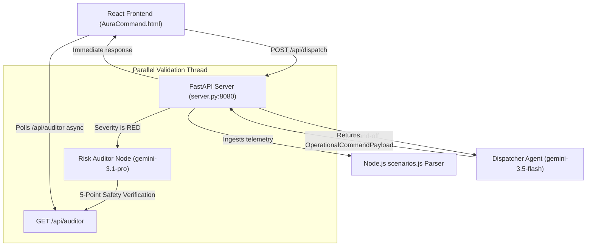

# AuraCommand · M. Chinnaswamy Stadium Smart Operations Engine

AuraCommand is a premium, high-throughput, multi-agent operational safety and incident management dashboard built for the **Agentic Premier League Grand Finale**. It fuses high-performance AI agents running the **Google Gen AI SDK** with a gorgeous, high-fidelity glassmorphic React operator interface.

---

## 🚀 Key Features

* **Multi-Agent Orchestration**:
  * **Sensor Ingestion Node (Rule-Based)**: Ingests real-time turnstile rates, concourse densities, meteorological feeds, and perimeter telemetry.
  * **Command Dispatcher Agent (`gemini-3.5-flash`)**: Evaluates anomalous events and automatically generates structured mitigation directives and trilingual Public Address (PA) announcements.
  * **Asynchronous Risk Auditor (`gemini-3.1-pro`)**: Executed via non-blocking parallel execution on RED-alert posture events to run a rigorous 5-point safety SOP check without slowing down the primary dispatcher.
* **Instant Public Address (PA) System**:
  * **Background Pre-fetching**: Instantly fetches and decodes trilingual audio buffers during scenario playback, bringing latency down to **0ms on first-click**.
  * **In-Memory Audio Buffer Caching**: Implements raw Web Audio API buffer storage in the browser, making replays instant with **zero additional network requests or API costs**.
  * **Dynamic Visualizer**: Real-time pulsing and glowing indicator reflecting exact states (`STANDBY`, `GENERATING`, `DECODING AUDIO`, `READY (INSTANT)`, or `BROWSER SPEECH FALLBACK`).
* **Developer Deck & Playback Suite**: Includes custom model selection, full token/billing telemetry tracking, and Pydantic-validated payload inspection consoles.

---

## 🛠️ Architecture Overview



---

## ⚙️ Running Locally

### 1. Prerequisites
Ensure you have Python 3.10+ and Node.js installed, along with your Gemini API credentials configured:
```bash
export GEMINI_API_KEY="your-api-key"
```

### 2. Install Dependencies
```bash
pip install google-genai fastapi uvicorn pydantic
```

### 3. Launch the Server
```bash
python server.py
```
This boots up the FastAPI backend on port `8080` and automatically hosts the static glassmorphic React frontend assets. Open [http://localhost:8080](http://localhost:8080) in your browser.

---

## 🌐 Production Deployment

The engine is containerized using Docker and deployed with high-availability configurations to **Google Cloud Run**:

* **Production URL**: [https://auracommand-58854437368.us-central1.run.app](https://auracommand-58854437368.us-central1.run.app)
* **Region**: `us-central1`
* **Project ID**: `luminous-bazaar-496916-h3`

Deployments are executed securely using the official Google Cloud CLI:
```bash
gcloud run deploy auracommand --source . --region us-central1 --allow-unauthenticated --project luminous-bazaar-496916-h3
```

---

## 📡 API Endpoints

| Endpoint | Method | Description |
| :--- | :---: | :--- |
| `/api/dispatch` | `POST` | Accepts active scenario keys, ingests telemetry, and executes the agent pipeline. |
| `/api/auditor` | `GET` | Fetches the current status and clearance verdict of the asynchronous Auditor agent. |
| `/api/tts` | `POST` | Generates trilingual speech base64 data on-demand. |
| `/api/tts-status` | `GET` | Queries the pre-generated background TTS status. |
| `/api/health` | `GET` | Basic service and model connectivity check. |
